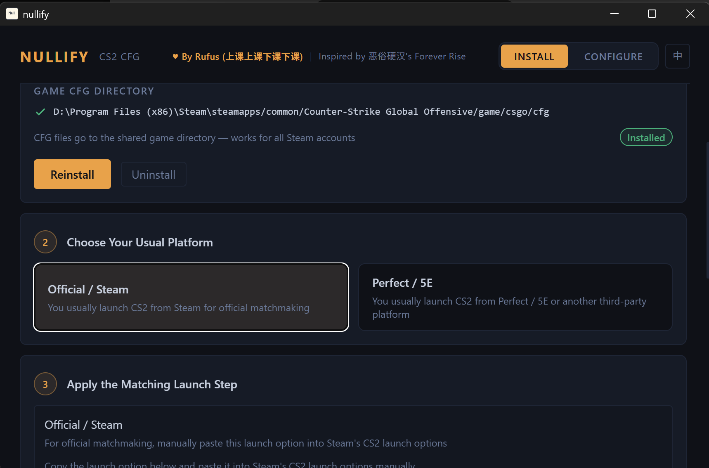

# nullify



`nullify` is a Windows desktop installer for CS2 CFG setup, built with Tauri, React, TypeScript, and Tailwind CSS.

It helps users detect local Steam accounts, install the bundled CFG set, configure launch options for Steam or third-party platforms, and manage feature keybinds from a simple desktop UI.

## Overview

`nullify` is designed as a guided installer instead of a raw config pack. The app walks the user through:

- detecting available Steam accounts
- installing or uninstalling the bundled CFG files
- applying the correct launch flow for Steam or third-party platforms
- configuring bhop, jump throw, jumpbug, and related binds
- closing the setup once everything is ready

## Features

- Detect local Steam accounts
- Install or uninstall CFG files
- Guide launch option setup for Steam and third-party platforms
- Configure bhop, jump throw, jumpbug, and related keybinds

## Requirements

- Windows
- Node.js
- Rust / Cargo

## Quick Start

```bash
cd app
npm install
```

## Development

```bash
cd app
npm run tauri dev
```

## Build

```bash
cd app
npm run tauri build
```

The packaged desktop output is produced by Tauri under the build artifacts generated from `app/src-tauri`.

## Project Layout

- `app/`: frontend and Tauri application
- `cfg/`: generated and bundled CFG files
- `tools/`: helper generation scripts
- `docs/`: README assets
